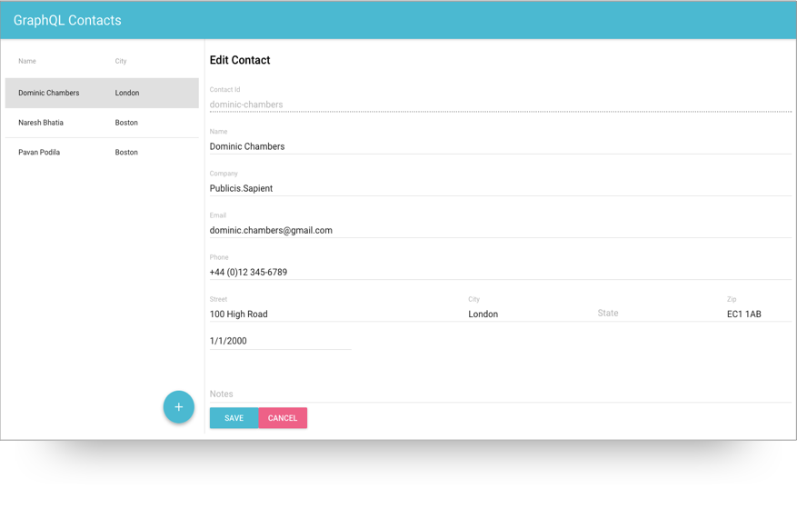

GraphQL Contacts
================



Getting started
---------------
Ensure you have [graphql-contacts-server](https://github.com/sapientglobalmarkets/graphql-contacts-server) installed and running first, then:

```bash
$ npm install <--- substitute with yarn if you prefer it
$ npm start
```

Now point your browser to [http://localhost:3000/](http://localhost:3000/).

Patterns Implemented
--------------------
1. Master-Detail UI Pattern: See [`src/MasterDetail/index.js`](https://github.com/sapientglobalmarkets/graphql-contacts/blob/master/src/MasterDetail/index.js)
2. Form validation: See [`src/ContactForm/ContactForm.js`](https://github.com/sapientglobalmarkets/graphql-contacts/blob/master/src/ContactForm/ContactForm.js)
3. Observable View Models using GraphQL: See [`src/ContactsList/index.js`](https://github.com/sapientglobalmarkets/graphql-contacts/blob/master/src/ContactsList/index.js) and [`src/ContactForm/index.js`](https://github.com/sapientglobalmarkets/graphql-contacts/blob/master/src/ContactForm/index.js)
4. Persistence using GraphQL: See [`src/ContactForm/index.js`](https://github.com/sapientglobalmarkets/graphql-contacts/blob/master/src/ContactForm/index.js)
